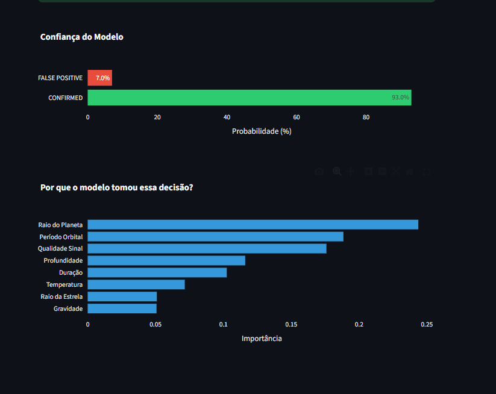

# 🪐 Exoplanet Detector com Machine Learning

[](https://exoplanet-detector-ml-nzvm3wleuuvcm8y8mmsfka.streamlit.app/)

## Visão Geral

Este projeto de Machine Learning utiliza dados reais da missão Kepler da NASA para identificar exoplanetas. O objetivo é classificar objetos de interesse (KOIs) como **CONFIRMED** (planetas confirmados) ou **FALSE POSITIVE** (falsos positivos), e prever quais novos candidatos possuem maior probabilidade de serem exoplanetas reais.

## 🚀 Acesse a Aplicação Online

Experimente o detector de exoplanetas em tempo real: [https://exoplanet-detector-ml-nzvm3wleuuvcm8y8mmsfka.streamlit.app/](https://exoplanet-detector-ml-nzvm3wleuuvcm8y8mmsfka.streamlit.app/)

## 📌 Contexto e Motivação

A detecção de exoplanetas é um campo crucial na astronomia, e o método de trânsito (observação de pequenas variações no brilho estelar) é uma das abordagens mais eficazes. Este projeto busca aplicar técnicas de Machine Learning para automatizar e aprimorar esse processo, utilizando o vasto catálogo de dados fornecido pelo telescópio Kepler.

## ⚙️ Tecnologias Utilizadas

*   **Python:** Linguagem de programação principal.
*   **Pandas & NumPy:** Manipulação e análise de dados.
*   **Scikit-learn:** Construção e avaliação do modelo de Machine Learning.
*   **Imbalanced-learn (SMOTE):** Tratamento de dados desbalanceados.
*   **Matplotlib:** Visualização de dados (para análise exploratória e importância de features).
*   **Joblib:** Serialização e desserialização do modelo.
*   **Streamlit:** Desenvolvimento da interface web interativa.
*   **Lightkurve:** Exploração de curvas de luz (em notebooks de exploração).

## 🧠 Pipeline do Projeto

1.  **Coleta de Dados:** Aquisição de dados do catálogo Kepler Objects of Interest (KOI) da NASA.
2.  **Limpeza e Seleção de Features:** Preparação dos dados e escolha das características mais relevantes.
3.  **Balanceamento de Classes:** Aplicação de SMOTE para lidar com o desbalanceamento entre classes de planetas confirmados e falsos positivos.
4.  **Treinamento do Modelo:** Utilização de um classificador Random Forest.
5.  **Avaliação do Modelo:** Análise de métricas de desempenho.
6.  **Predição:** Aplicação do modelo em novos candidatos a exoplanetas.
7.  **Interface Web:** Desenvolvimento e deploy de uma aplicação interativa com Streamlit.

## 📊 Features Utilizadas

O modelo foi treinado utilizando as seguintes características físicas observáveis, que são cruciais para a detecção de exoplanetas:

*   `koi_period`: Período orbital (dias)
*   `koi_depth`: Profundidade do trânsito
*   `koi_duration`: Duração do trânsito
*   `koi_prad`: Raio do planeta (raios terrestres)
*   `koi_model_snr`: Relação sinal/ruído do modelo
*   `koi_steff`: Temperatura efetiva da estrela (Kelvin)
*   `koi_slogg`: Gravidade superficial da estrela (log g)
*   `koi_srad`: Raio da estrela (raios solares)

## 🧠 Observação Importante: O Desafio do Data Leakage

Durante o desenvolvimento, foi crucial identificar e mitigar um problema de *data leakage*. Variáveis que atuavam como "atalhos" para o modelo, levando a uma acurácia artificialmente alta (~99%), foram removidas. Embora a acurácia tenha sido ajustada para um valor mais realista (~92%), o modelo final é **significativamente mais confiável e generalizável**, pois se baseia apenas em características físicas genuínas e evita o overfitting.

## 🤖 O Papel da Inteligência Artificial (Claude AI) no Desenvolvimento

Este projeto foi desenvolvido com o auxílio significativo de ferramentas de Inteligência Artificial generativa, especificamente o **Claude AI**. O Claude atuou como um assistente inteligente, otimizando diversas etapas do processo de desenvolvimento:

*   **Geração de Ideias e Estrutura:** Auxiliou na concepção da estrutura do projeto e na organização dos módulos de código.
*   **Depuração e Otimização de Código:** Contribuiu para a identificação e correção de erros, além de sugerir otimizações para trechos de código complexos.
*   **Esclarecimento de Conceitos:** Foi uma ferramenta valiosa para aprofundar o entendimento de conceitos de Machine Learning e técnicas de pré-processamento de dados, como o SMOTE.
*   **Redação de Documentação:** Ajudou na elaboração e refinamento de partes da documentação, incluindo este `README.md`, garantindo clareza e concisão.

O uso do Claude AI permitiu focar mais na lógica do negócio, na análise crítica dos resultados e na mitigação de desafios complexos como o *data leakage*, otimizando o tempo de desenvolvimento e aprofundando o aprendizado. A integração de IAs como o Claude é uma prática moderna que demonstra a capacidade de alavancar ferramentas de ponta para resolver problemas de forma eficiente e inovadora.

## 📈 Resultados

O modelo Random Forest desenvolvido foi capaz de:

*   Classificar com sucesso planetas confirmados e falsos positivos.
*   Identificar candidatos promissores a exoplanetas.
*   Fornecer insights sobre a importância das características na detecção.

## ⚠️ Limitações e Melhorias Futuras

**Limitações:**
- O modelo utiliza dados já processados, não curvas de luz brutas
- Depende da qualidade do dataset da NASA
- SMOTE pode introduzir viés se não controlado

**Melhorias Futuras:**
- Explorar uso direto de curvas de luz
- Aplicar Deep Learning para detecção mais precisa
- Implementar validação cruzada (k-fold) mais robusta

## 📸 Interface


## 💻 Como Executar Localmente

Para rodar o projeto em sua máquina:

### 1. Clonar o repositório

```bash
git clone https://github.com/kauan-augusto-m/exoplanet-detector-ml.git
cd exoplanet-detector-ml
```

### 2. Instalar dependências

```bash
pip install -r requirements.txt
```

### 3. Treinar o modelo

```bash
python src/modelo.py
```

### 4. Fazer previsões (opcional)

```bash
python src/prever.py
```

### 5. Iniciar a interface web

```bash
streamlit run src/app.py
```

## 👨‍💻 Autor

**Kauan Augusto**

## 📄 Licença

Este projeto está licenciado sob a Licença MIT. Veja o arquivo [LICENSE](LICENSE) para mais detalhes.